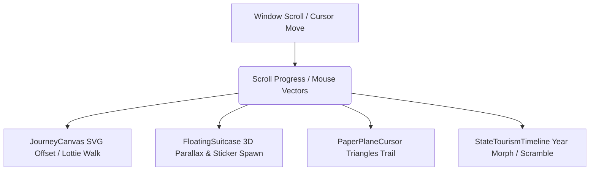

# Journey-Pulse — Cinematic 3D Travel Intelligence

A premium, interactive, 3D scroll-driven travel aggregator and visa compliance tracker built on Next.js 14 App Router, Tailwind CSS, Prisma, and Supabase.

---

## Animation & 3D Architecture

The frontend is built to deliver a cinematic, story-driven travel journey with high performance, smooth frame rates, and strict adherence to accessibility standards.

### 1. Scroll-Driven Path Tracing & Lottie Sync
- **JourneyCanvas**: Renders a custom glowing SVG route across the screen width. Scroll triggers interpolate the path's `strokeDashoffset` smoothly.
- **Math Tracing**: A Lottie walker element walks along the active SVG line using mathematical coordinate tracking (`path.getPointAtLength`) to calculate translation vectors and rotation angles dynamically on scroll.
- **Cross-fading Backgrounds**: Six curated CSS gradient backgrounds (ranging from sunrise departure colors to deep ocean sunsets) cross-fade seamlessly as scroll progress passes narrative milestones.

### 2. Procedural 3D Suitcase & Parallax Springs
- **FloatingSuitcase**: Uses React Three Fiber (R3F) to render a procedural low-poly travel suitcase modeled out of rounded boxes, leather straps, and corner guards.
- **Mouse Parallax**: Tracks screen coordinates to apply gentle floating bobs and spring translations.
- **Dynamic Sticker Spawning**: As the user scrolls past sections mentioning countries (India, Thailand, Spain, France), corresponding travel stickers appear on the suitcase in real-time.

### 3. Interactive Passport Booklet & Confetti Bursts
- **Passport3D**: A 3D booklet mesh in R3F. On first click, it open-rotates its front cover cover.
- **Page Flipping**: Subsequent clicks turn pages to reveal visa stamps (Visa-Free, On-Arrival, e-Visa) dynamically fetched from Supabase outbound records.
- **Confetti Explosion**: Each stamp trigger fires a `canvas-confetti` explosion with colors matched to the country flags.

### 4. Interactive Choropleths & Alerts Globes
- **VisaMap**: Renders a vector choropleth using `react-simple-maps` displaying visa statuses for Indian citizens (Orange = Visa Free, Yellow = VoA, Pink = e-Visa). Includes hover tooltips and details slide-out side drawers.
- **AdvisoriesGlobe**: Leverages `react-globe.gl` to showcase security advisories. Pulsing red 3D coordinates markers expand on click to detail security risks and health warnings.

### 5. Performance Optimization & Accessibility Gates
- **JS Budget & Latency**: Heavy 3D components and maps are wrapped in Next.js `dynamic()` imports with SSR disabled, loading skeleton placeholders (`BoardingPassSkeleton` / `CompassSpinner`) to ensure first contentful paint (FCP) remains under Lighthouse targets.
- **Prefers-Reduced-Motion**: A global check hook listens to media preferences and toggles a `data-motion="off"` state on the HTML element. This shuts down all 3D canvases, Lottie animations, and scroll-jacks, falling back to clean high-fidelity static illustrations.
- **Skip Animations**: A sticky toggle button persists animation preferences in `localStorage` to allow manual control.
